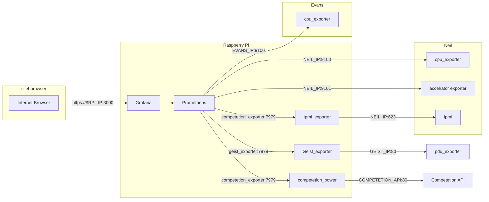

# Raspberry Pi Configuration

Mode: RPI 3

In `~/.ssh/config`:
```
Host scc-pi
	User y5jing
	HostName bunny.sdsc.edu
	HostKeyAlias scc-pi
	IdentityFile ~/.ssh/id_ed25519-ucsd
	KbdInteractiveAuthentication no
Host scc-pi-forward
	# Neil BMC: https://localhost:22220
	# PDU: http://localhost:22221
	# Craig BMC: https://localhost:22222
	# Evans BMC: https://localhost:22223
	User y5jing
	HostName bunny.sdsc.edu
	HostKeyAlias scc-pi
	IdentityFile ~/.ssh/id_ed25519-ucsd
	KbdInteractiveAuthentication no
	LocalForward 127.0.0.1:22220 192.168.4.20:443
	LocalForward 127.0.0.1:22221 192.168.4.4:80
	LocalForward 127.0.0.1:22222 192.168.4.22:443
	LocalForward 127.0.0.1:22223 192.168.4.23:443
	ExitOnForwardFailure yes
	SessionType none
	RequestTTY no
	StdinNull yes
```

SSH host key fingerprint:
```
y5jing@miniman:~$ ssh-keygen -lvf /etc/ssh/ssh_host_ed25519_key.pub
256 SHA256:iRAFlJvRw/yDxIgmFUzNlRzF/kjuOSokY6RfkAGQSN0 root@ubuntu (ED25519)
+--[ED25519 256]--+
|*B=*=%+=.        |
|+ =.*EX .        |
| o o.= =         |
|  + o...=.       |
| o .  .oS+       |
|. + o   o .      |
| o =   . .       |
|  . .   +        |
|     ... .       |
+----[SHA256]-----+
```

## Networking

The main Ethernet port provides Internet access, while each BMC is attached via a Ethernet to USB adapter.

In `/etc/netplan/00-networking.yaml`:
```
network:
  ethernets:
    eth0:
      dhcp4: no
      addresses: [192.31.21.197/24]
      routes:
        - to: default
          via: 192.31.21.1
      nameservers:
        addresses: [132.249.20.25,198.202.75.26]
    enx00e01e700091:
      dhcp4: no
      addresses: [192.168.4.69/24]
      routes:
        - to: 192.168.4.20
    enx7cc2c6447e33:
      dhcp4: no
      addresses: [192.168.4.21/24]
      routes:
        - to: 192.168.4.22
    enx7cc2c632258f:
      dhcp4: no
      addresses: [192.168.4.99/24]
      routes:
        - to: 192.168.4.23
  version: 2
```
Add one interface for each additional device.  After making changes, `sudo netplan apply`.

## Grafana

### Competetion setup
Here's a description of the setup for the competition. 

1. Download the repo from github
2. `cd monitoring`
3. `cp .env.dist .env`
4. Edit the .env file to match your setup
5. edit `prometheus/prometheus.yml` to match your setup. You need to change all the ip's. Look at the diagram below for reference.
6. run ´bin/prodcution-start´

Grafana runs on the raspberry pi, and is accessible via on port 3000. The default username is adming, and the password, you have to provie in an environment variable.  The default password is `admin`.


I think the COMPETETION_API is 140.221.235.139.

From here everything should work as before. Remember to use your users to login, to se dashboards. They can be found here: https://discord.com/channels/964584288609775726/1026772648061055056/1030625369331613756

There should be a competetion dashboard, that shows power draw and gpu usage.
You don't have the Fan dashboard, yet unforrunatly. ://

